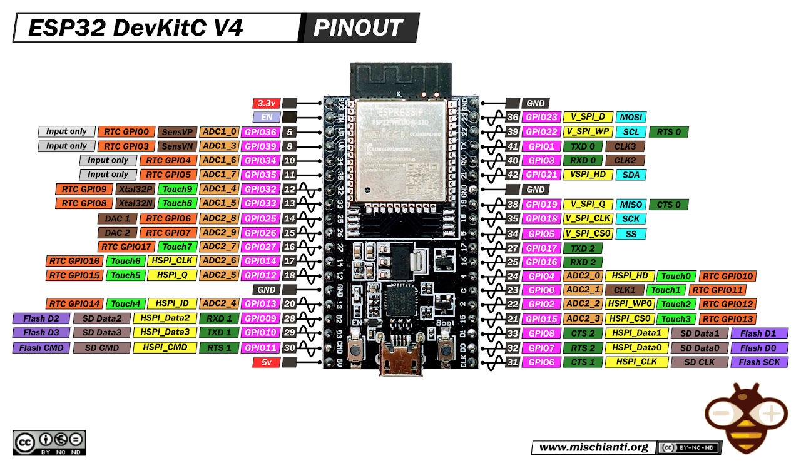

# CNC Pendant Controller

This project implements a CNC pendant controller using an ESP32 with Zephyr RTOS. It translates rotary encoder signals and switch inputs into FluidNC-compatible G-code commands, sent over UART.

## Features
* **Rotary Encoder Support**: Tracks clockwise/counterclockwise movement to generate incremental G-code.
* **Axis Selection**: Switch inputs for X, Y, Z axis selection.
* **Scale Factors**: Supports x1, x10, x100 movement scaling via switches.
* **FluidNC Integration**: Generates G-code compatible with FluidNC firmware (e.g., $J=G91 G21 X0.010 F1000).
* **Modular Design**: Separates encoder handling, G-code generation, GPIO management, and UART communication into distinct classes.

## Hardware Requirements
* **Board**: ESP32 (e.g., esp32_devkitc_wroom or similar).
* **Peripherals**:
    * Rotary encoder (with A, B, A_INV, B_INV pins).
    * GPIO switches for axis selection (X, Y, Z) and scale factors (x1, x10, x100).
    * UART connection to a FluidNC-compatible CNC controller.

## Setup and Build
1. Install Zephyr SDK and toolchain.

2. Build the project:
    ```bash
    west build -p always -b esp32_devkitc_wroom/esp32/procpu .
    ```

3. Flash the project:
    ```bash
    west flash
    ```

4. Connect the ESP32 to the CNC controller via UART.

## Wiring

Connect the rotary encoder and switches to the ESP32 GPIO pins as follows. The table assumes a common pinout for the ESP32 DevKitC V4 and wiring colors of my pendant.




| Component | Signal | GPIO Pin | Cable Color |
|-----------|--------|----------|-------------|
| Rotary Encoder | A | 15 | Green |
| Rotary Encoder | B | 16 | White |
| Rotary Encoder | A_INV | - | Violet |
| Rotary Encoder | B_INV | - | Violet/Black |
| Axis Selection | X | 17 | Yellow |
| Axis Selection | Y | 18 | Yellow/Black |
| Axis Selection | Z | 19 | Brown |
| Scale Factor | x1 | 21 | Grey |
| Scale Factor | x10 | 22 | Grey/Black |
| Scale Factor | x100 | 23 | Orange |
| Common Ground | GND | GND | Orange/Black |
| UART TX | TX | 25 | Pink |
| UART RX | RX | 26 | Cyan |
